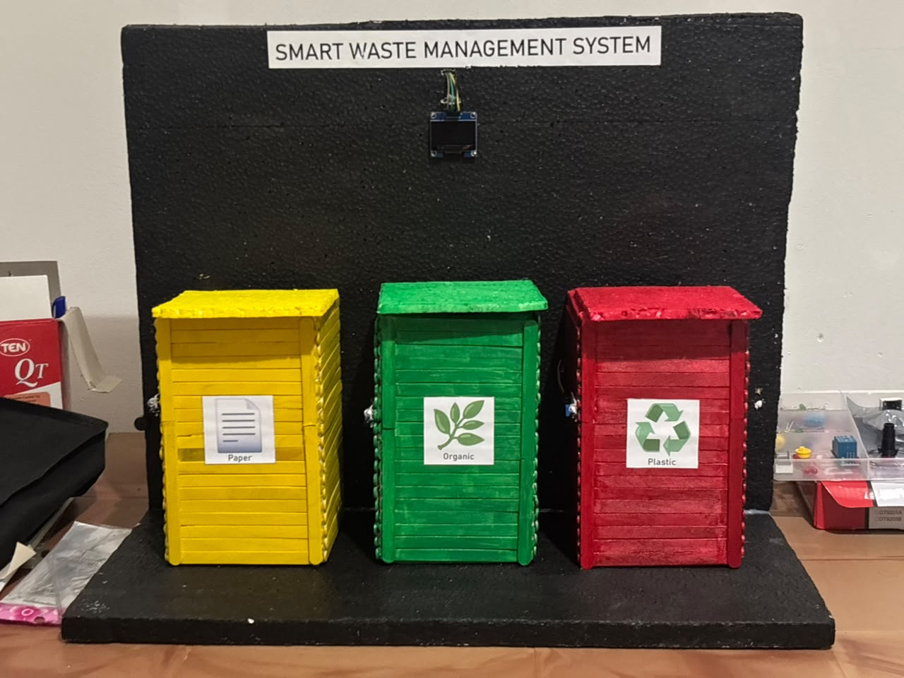

# 🌍 Smart Waste Management System (IoT)

A complete, touchless, and real-time smart waste management solution. This project integrates automated hardware with a live web dashboard to monitor waste levels, prevent overflowing, and ensure a hygienic environment.

### 🔴 [Click Here to View Live Demo]( https://pasindu-surath.github.io/Smart-Waste-Management-System/)

---

## 🚀 Key Features

* **Touchless Operation:** IR sensors detect user presence, and Servo motors automatically open the bin lids, preventing physical contact and germ spread.
* **Real-Time Monitoring:** Ultrasonic sensors measure the garbage level inside the bins continuously.
* **Live Web Dashboard:** Built with HTML, CSS, and Vanilla JavaScript, the dashboard connects to a Firebase Realtime Database to display live bin levels (0-100%).
* **Categorized Disposal:** Three distinct sections for Paper (Yellow), Organic (Green), and Plastic (Red).
* **Automated Alerts:** A built-in buzzer sounds when a bin reaches 100% capacity, and the dashboard flashes a 'FULL' warning for sanitation workers.

## 🛠️ Technology Stack

**Hardware:**
* Arduino UNO (Controls IR sensors & Servo motors)
* ESP32 Wi-Fi Module (Reads Ultrasonic data & sends it to Firebase)
* Ultrasonic Sensors (HC-SR04)
* IR Proximity Sensors
* Servo Motors & Local LCD Display
* Buzzer Module

**Software / Web Dashboard:**
* Frontend: HTML5, CSS3, Vanilla JavaScript
* Backend/Database: Firebase Realtime Database (BaaS)
* C++ (For Arduino and ESP32 programming via Arduino IDE)

## 📂 Project Structure

This repository contains both the hardware logic and the software interface:

* `/web-dashboard/` - Contains `index.html`, styling, and the extracted `script.js` which handles the DOM manipulation and Firebase connection.
* `/hardware-code/` - Contains the `.ino` files for both the Arduino board and the ESP32 module.

## ⚙️ Setup & Installation

**1. Web Dashboard:**
* Navigate to the `/web-dashboard/` folder.
* Update the `script.js` file with your own Firebase Configuration keys.
* Open `index.html` in any modern web browser to view the dashboard.

**2. Hardware:**
* Open the `/hardware-code/` folder using the Arduino IDE.
* Flash `arduino_controller.ino` to your Arduino board.
* Update the Wi-Fi credentials and Firebase URL inside `esp32_firebase.ino` before flashing it to your ESP32 board.
